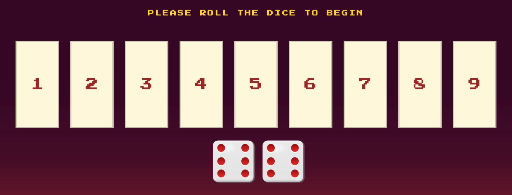

# Shut The Box
Shut The Box is a dice game that can be enjoyed among friends, colleagues and family members anywhere and anytime. The game combines the element of strategic planning and random element of dice rolling outcome. It is great for teaching kids basic addition and subtraction. It helps to build mental math skills and is really fun to play. On another hand it is a century old game that has been popularly played in pubs among friends and therefore is a great game to help people socialise. 

As it is a game that has been around for some time a retro design was used to create this game in a computer version to give the feel and look of the game and may therefore induce nostalgic feeling in some players. 

Users of this game learn the rules of Shut The Box so they can apply it to strategic planning and decision making with others in their lives. 

[View Shut The Box Game live project here](https://whon1980-dl.github.io/shut-the-box-game/)

- - -

## Table of Contents

### [User Experience (UX)](#user-experience-ux-1)
### [Design](#design-1)
### [Features](#features)
* [Existing Features](#existing-features)
### [Features Left to Implement](#features-left-to-implement-1)
### [Technologies Used](#technologies-used-1)
### [Frameworks, Libraries & Programs Used](#frameworks-libraries--programs-used-1)
### [Testing](#testing-1)
* [Bugs](#bugs)
* [Validation Results](#validation-results)
* [Manual Testing](#manual-testing)
* [Lighthouse Report](#lighthouse-report)
### [Deployment and local development](#deployment-and-local-development-1)
* [GitHub Pages](#github-pages)
* [Forking the GitHub Repository](#forking-the-github-repository)
* [Local Clone](#local-clone)
### [Credits](#credits-1)
### [Acknowledgements](#acknowledgements-1)
---

## User Experience (UX)

The website will be targeted towards adults and children as a simple app to learn, practice and have fun with.

The name of the game is clearly shown in bright yellow colour to shout out and the question above it is to challenge a player to try the game. 

The app also provides a  clear instruction of how to play. Buttons allowing players to navigate around the game such as start game and exit game provide ways for user to toggle between start screen and game screen. 

During game play messages are alert to help guid players through the game. Reset button is provided for easy game resetting if player wants to start a new game.

* First-time visitor goals
     * Looking for game to enjoy amonng family or friends. Looking for game that can be use to teach their children simple addition and subtraction. Looking for game that they have played before on non-computer version.
     * Understand the rules of the game and how to use the game control.
     * Easily navigate throughout the whole app with displayed alert messages that clearly guid player how to play.
     * Be drawn to responsive design that allow for enjoyable experience when accessing the site from any devices.
     * Be urged to try again and again to win the game buy shutting the box.

* Returning visitors goals
    * Players who could not shut the box the first time and want to try new strategy to win the game or beat their previous score.
    * Player who want to introduce the game to their family and friends.

* Frequent user goals
    * Player who really enjoy the game and drown to the game by the challege of winning the game.
    * Player who look forward to game update that may include new features. 
- - -

## Design

* Colour Scheme
    * Primary colours used on the website: 
    * Image containing Purple and Rose colour is used as main background image to portrait a retro look and feel of olden day neon lights. 

* Typography
    * Press-Start-2P which has a pixel characteristic is used as main font to again keeps the retro look of the app.
    * IBM-Plex-Mono which has a code style font is used in the game rules box to keep the retro look of the app as if they are reading it off an old computer command prompt. 

* Button Style
    * Rigid square boxes style is used for buttons to complement the look of pixel type font which again keep the design to the retro concept.

* Wireframes
    Pen and paper in a notebook for planning function sequences and Figma web app for UX design.

- - -

## Features

* This website is targeting adults and children who would like to enjoy a game that incorporate some element of chances and strategic planning into one. The game round is quick and can be played among a group of people during their socialising time. Kids can also learn simple addition and subtraction from playing the game while having fun at the same time.

### Existing Features

#### Start Page

* Header
    * Featured at the top of the page, the header shows a message that challenge the player to play and the game name is displayed in bright yellow colour below the challenge message. 
    * This header clearly indicate the player what game they are playing. 

    

* The Start Game and How To Play Options Section
    * Player who has played the game elsewhere before can either choose to dive straight into the game by selecting the Start Game option or revisit the rules of the game be selecting How To Play button.
    * How to play button is designed using modal box concept where the box that contain game rule only gets revealed once button is clicked to be displayed over the start game page.
    
    
    

#### Game Page

* The Exit Game and Reset Game buttons
    * Exit Game button can be found right at the top left hand corner of the game screen. This allows user to choose if they want to exit the game perhaps to revisit the game rules before trying to play the game again. 
    * Reset button can be found right at the top right hand corner of the game screen. This button allows user to reset the game progress and start the game all over again which could be after winning, Game Over or mind changing without the neext to exit game or refresh page. 

    

* The Main Game Canvas Area
    * This area of the game page shows all 9 interactive tiles and dice that will be used for rolling to get the sum. 
    * These tiles are interactive where player can select tile/s after rolling the dice from here. The tile will also change colour after being selected and will become invisible altogether once the sum of dice is met either by the flipped tile itself being equal to sum of dice or subsequence selection adding to it to become equal to sum of dice. This help player keeping track of the progress. 
    * This area also is where all the alert messages to guid player through the game is displayed in gold colour. The message will alert if the correct process of the game isn't followed such as if player select a tile without rolling the dice first an alert message will show as Please roll the dice!.

    

* Game Control Area and Score Display
    * This area contain Roll The Dice button that allows the player to initiate the game. 
    * A feature is implementedd so that dice can only be rolled once after which a tile needs to be flip thus preventing any player who may not like what they see and want to roll the dice again before fliping a tile.
    * Calculate Score button is also available in the situation when the game does not calculate the score automatically. The score is displayed below the buttons for player to take note of their score and to compare with other players. 
    
    

* The Game Results
    * When player flip the tiles and the sum is equal to sum of dice the tiles will disappear and message will show Great Job!. When player flip a tile/s but the sum of their selected tile is still less than sum of dice the game will prompt player to select another tile with a message Flip another tile. If the tiles left can not be used to add up to sum of dice the game will display game over and score display automatically as well as Game Over message displayed. 
    * Various if-else statement are used to meet each possible outcome of tile/s selection. If the game over is not triggered automatically the user can also trigger it by clicking on calculate score where a score will be displayed and game over. 
    * The game score is displayed clearly for player to take note in order to compare to see who the winner is.
    * In the situation when player manage to flip all the tiles in one game, the alert will also let them know that they have shut the box by congratulate them and therefore automatically declared a winner of the game message displayed. 
    * After the game over is triggered player can start new game by clicking the Reset Game button. All of these features are very convenient and easy to utilise.

    

_ _ _

## Features Left to Implement
* When there is time, I would like to add a feature that allow player to deselect tile incase they accidentally select the wrong one.
* Also when there is time, I would like to create a dedicated page for the game result page to make it more stand out. 

## Technologies Used

 * [HTML5](https://en.wikipedia.org/wiki/HTML5)
 * [CSS3](https://en.wikipedia.org/wiki/CSS)
 * [JavaScript](https://en.wikipedia.org/wiki/JavaScript)

_ _ _

## Frameworks, Libraries & Programs Used

 * [Gitpod](https://www.gitpod.io/)
    * To write the code.
 * [Git](https://git-scm.com/)
    * For vesion control.
 * [Github](https://github.com/)
    * Deployment of the website and storing the files online.
 * [Google Fonts](https://fonts.google.com/)
    * Import main font for the website.
* [Figma](https://www.figma.com)
    * Create mockup design of the UX.
 * [Am I Responsive](https://ui.dev/amiresponsive)
    * Mockup picture for the README file.
_ _ _

## Testing

The W3C Markup Validator and W3C CSS Validator services were used to validate every page of the project to ensure there were no errors. JSHint was used to helps to detect errors and potential problems in my JavaScript code.

 * [W3C Markup Validtor](https://validator.w3.org/)
 * [W3C CSS Validator](https://jigsaw.w3.org/css-validator/)
 * [JSHint, a JavaScript Code Quality Tool](https://jshint.com/)

_ _ _

### Bugs
#### Solved bugs
* When I create a function and saw that the if-else condition were not correctly match I noticed the function were never stop their execution so I added a 'return;' to each function and that fixed the problem.
* An = sign was also used in the wrong context instead of == sign being used in the comparison statement which resulted in a lot of expected bugs which was then identified and corrected afterwords. 

### Validation results

index.html

style.css

script.js

### Manual Testing

* The application was tested on Google Chrome, Microsoft Edge, and Safari browser.
* The application was viewed on a desktop computer, laptop, Samsung Galaxy Tab S9 tablet and Motorola G32 mobile phone.
* A large amount of testing was done to ensure all buttons and features are working correcly and alert messages displayed accordingly.
* Family and friends were asked to review the application for a better understanding of the user experience.
* Dev Tools was used to test how the site looks on various screen sizes and console log was used extensively to see which function was executed.

| What was done | Working correctly? |
|---------------------|:---------------------:|
| Checking the HTML code on Validator HTML successful      | YES        |
| Checking the CSS code on Validator CSS successful      |YES|
| Checking the JavaScript code on JSHint successful      |YES|
| Checking Lighthouse for mobile device  successful      | YES|
| Checking Lighthouse for desktop device successful      | YES|
| I clicked on the "START GAME" and "HOW TO PLAY" buttons      | YES|
| I clicked on "EXIT GAME" and "RESET GAME" buttons       |YES|
| I clicked on ech tile before rolling th dice messag alert "Please roll the dice!"       |YES|
| I also checked that the "Start" and "New Game" buttons change color and are visually different after being pressed|YES|
| Checked whether the player's name, time and rating are displayed in the results table       |YES|
|I checked whether amethe player's rating changes depending on the time spent by the player on the game|YES|

### Lighthouse Report

#### Mobile analysis

Shut The Box

#### Desktop analysis

Shut The Box

_ _ _

## Deployment and local development

### GitHub Pages

GitHub Pages used to deploy live version of the website.
1. Log in to GitHub and locate [GitHub Repository Shut The Box Game](https://github.com/Whon1980-DL/shut-the-box-game)
2. At the top of the Repository(not the main navigation) locate "Settings" button on the menu.
3. Scroll down the Settings page until you locate "GitHub Pages".
4. Under "Source", click the dropdown menu "None" and select "Main" and click "Save".
5. The page will automatically refresh.
6. Scroll back to locate the now-published site [link](https://whon1980-dl.github.io/shut-the-box-game/) in the "GitHub Pages" section.

### Forking the GitHub Repository

By forking the repository, we make a copy of the original repository on our GitHub account to view and change without affecting the original repository by using these steps:

1. Log in to GitHub and locate [GitHub Repository Shut The Box Game](https://github.com/Whon1980-DL/shut-the-box-game)
2. At the top of the Repository(under the main navigation) locate "Fork" button.
3. Now you should have a copy of the original repository in your GitHub account.

### Local Clone

1. Log in to GitHub and locate [GitHub Repository Shut The Box Game](https://github.com/Whon1980-DL/shut-the-box-game)
2. Under the repository name click "Clone or download"
3. Click on the code button, select clone with HTTPS, SSH or GitHub CLI and copy the link shown.
4. Open Git Bash
5. Change the current working directory to the location where you want the cloned directory to be made.
6. Type `git clone` and then paste The URL copied in the step 3.
7. Press Enter and your local clone will be created.

_ _ _

## Credits

### Code
 * The README template was helpfully provided by [Code Institute (template)](https://github.com/Code-Institute-Solutions/SampleREADME)

### Content

 * All content was written by the developer.
 * [Color contrast checker](https://coolors.co/contrast-checker/112a46-acc8e5) was used to decide which colors would be used for the website.

### Media 

 * [Freepik](https://www.freepik.com/)For free retro background image.
 * [WPClipart](https://www.wpclipart.com/recreation/games/dice/die_face_6.png.html) For free dice images.
 * [Imgflip](https://imgflip.com/gif/96gh67) for dice rolling .gif creation.

_ _ _

## Acknowledgements

 * My mentor Mitko Bachvarov provided helpful feedback and guided through certain step of debugging process.
 * Slack community for encouragement and information.
 * My wife and my sons for testing the applicaiton several times and gave feedback on what need improving and what extra feature should be added. 

